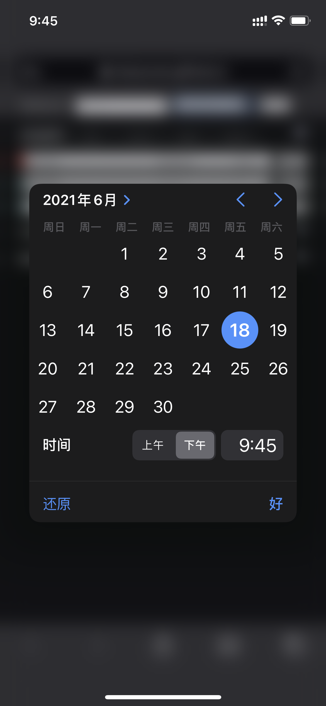
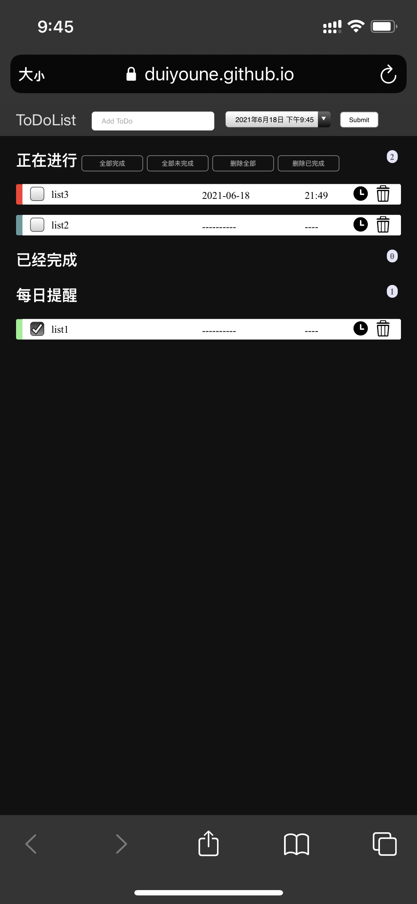

## Report

**1850106 陈子杰**

​	  2. 正文：简要介绍代码主要功能，突出亮点，加分项会考虑此处介绍；github仓库地址和部署后的作业 html 地址。

### 项目简介

本项目用原生html+css+js实现了一个TodoList，支持用户自定义添加todolist，并勾选完成。在此之上，还添加了一些额外功能，如设定项目截止日期、设定每日提醒等。

### 主要功能介绍及展示

#### 基础功能

+ 新增列表：在上方输入栏中输入list名字即可添加任务

+ 删除列表：点击任务右侧垃圾桶小图标即可删除列表
+ 展现列表：在正在进行、已经完成和每日提醒下方列表展现所有任务
+ 全部完成/取消：**正在进行**字样右侧有四个按钮，前两个分别为全部完成与全部未完成。点击后可以让所有选项全部完成或未完成。
+ 删除已完成/删除全部：后两个按钮分别为删除已完成/删除全部。点击后可以删除已完成选项或删除全部选项
+ 保存页面状态：使用网页的localstorage实现数据持久化功能。该存储状态不手动清除不会消失，因此可以当作本地数据库使用。

#### 高级功能

+ 添加日期：用户可以为任务添加截止日期。点击输入栏右侧的日历即可选择截止日期

+ 紧急提醒：每个人物左侧会有一个小边栏通过颜色来显示任务的紧急程度。红色为非常紧急，橙色为紧急，黄色为不紧急，灰色为已超过截止日期。没有设置截止日期的任务会显示为墨绿色。完成的任务显示为绿色。
+ 每日提醒：点击任务栏右侧的时钟图案可以将该任务设置为每日提醒。每日提醒的任务在每天结束后都会调整为非勾选状态。
+ 编辑单条todo：点击已经设定好的任务，可以通过输入栏x修改任务描述。
+ 左滑删除：在移动端，可以通过左滑任务来删除该任务。
+ 字体大小自适应：该网页可以自适应PC端与手机端，界面、字体自适应地调整为合适的大小
+ 适配深色模式与浅色模式：在手机端，网页可以根据手机端的深色或浅色模式自适应地调整为对应色系。
+ 删除todo手机震动提示：在左滑删除todolist的过程中，没有提示会显得有一些突兀，增加振动提示可以提高用户体验。由于适配原因，该功能仅在安卓端生效。
+ 自动排序：根据ddl时间先后顺序进行排序

#### 功能展示

+ 创建list：


+ 删除list：


+ 为list设置时间：




+ 将list添加到每日提醒：



+ 根据ddl显示任务紧急程度：


+ 全部完成：


+ 全部未完成：


+ 滑动删除：


#### 核心代码

+ 界面设计

  ```html
  <!DOCTYPE html>
  <html>
  <head>
      <meta http-equiv="Content-Type" content="text/html; charset=utf-8" />
      <meta name="viewport" content="width=600,viewport-fit=cover initial-scale=0.6, maximum-scale=1.0, user-scalable=no">
      <title>ToDoMVC</title>
      <link rel="stylesheet" href="./index.css">
  </head>
  <body>
      <div class="header">
          <div class="box">
              <form action="javascript:post()" id="form">
                  <label for="title">ToDoList</label>
                  <input type="text" id="title" name="title" placeholder="Add ToDo" required="required"
                      autocomplete="off" />
                  <input type="datetime-local" id="datetime" value=“2021-07-01T12：00” />
                  <button class="submit" id="submit">Submit</button>
              </form>
          </div>
      </div>
      <!-- 主体：在这进行任务和已完成 -->
      <div class="content">
          <h2 class="running">正在进行
              <button class="batch" onclick="allFinish()">全部完成</button>
              <button class="batch" onclick="allUnfinish()">全部未完成</button>
              <button class="batch" onclick="clearall()">删除全部</button> 
              <button class="batch" onclick="clearFinished()">删除已完成</button> 
              <span id="todocount"></span>
          </h2>
          <ol id="todolist" class="demo-box">
          </ol>
          <h2>已经完成 <span id="donecount"></span></h2>
          <ul id="donelist">
          </ul>
          <h2>每日提醒 <span id="repeatcount"></span></h2>
          <ol id="repeatlist" class="demo-box">
          </ol>
          <ul id="repeatdonelist">
          </ul>
      </div>
      <script type="text/javascript" src="./index.js"></script>
  </body>
  </html>
  ```

  

+ 获取list节点

  ```javascript
  function post() {
  
      var title = document.getElementById("title");
      var datetime = document.getElementById("datetime");
      if (title.value.trim() == "") {
          alert("内容不能为空");
      } else {
          var data = loadData();
          if (datetime.value.trim() == "") {
              var todo = { "title": title.value, "done": false, "repeat": false, "date": "----------", "time": "----", "lastchecktime": "" };
          } else {
              var todo = { "title": title.value, "done": false, "repeat": false, "date": datetime.value.substring(0, 10), "time": datetime.value.substring(11, 16), "lastchecktime": "" };
          }
          data.push(todo);
          saveData(data);
          var form = document.getElementById("form");
          form.reset();
          load();
      }
  }
  ```

+ 加载localstorage数据

  ``` javascript
  function loadData() {
      var collection = localStorage.getItem("todo");
      data = JSON.parse(collection);
      console.log(data);
      var today = getCurrTime().year.toString() + '-' + getCurrTime().month.toString() + '-' + getCurrTime().day.toString();
      if (data != null) {
          for (i = 0; i < data.length; i++) {
              if (data[i].repeat == true && data[i].lastchecktime != "" && data[i].lastchecktime != today)
                  data[i].done = false;
          }
      }
      if (data != null) {
          return data;
      } else return [];
  }
  ```

+ 存储数据

  ``` javascript
  function saveSort() {
      var todolist = document.getElementById("todolist");
      var donelist = document.getElementById("donelist");
      var repeatlist = document.getElementById("repeatlist");
      var ts = todolist.getElementsByTagName("p");
      var ds = donelist.getElementsByTagName("p");
      var rs = donelist.getElementsByTagName("p");
      var data = [];
      for (i = 0; i < ts.length; i++) {
          var todo = { "title": ts[i].innerHTML, "done": false };
          data.unshift(todo);
      }
      for (i = 0; i < ds.length; i++) {
          var todo = { "title": ds[i].innerHTML, "done": true };
          data.unshift(todo);
      }
      for (i = 0; i < rs.length; i++) {
          var todo = { "title": rs[i].innerHTML, "done": false };
          data.unshift(todo);
      }
  
      saveData(data);
  }
  function saveData(data) {
      localStorage.setItem("todo", JSON.stringify(data));
  
  }
  ```

+ 移除/更新列表中某一项

  ``` javascript
  //移除list中某一项
  function remove(i) {
      var data = loadData();
      var todo = data.splice(i, 1)[0];
      saveData(data);
      load();
  }
  //更新list中某一项
  function update(i, field, value) {
      var data = loadData();
      var todo = data.splice(i, 1)[0];
      todo[field] = value;
      data.splice(i, 0, todo);
      saveData(data);
      load();
      setLastCheckTime(i);
  }
  ```

+ 对list排序

  ```javascript
  对list进行排序
  function sort() {
      var data = loadData();
      if (data.length > 0) {
          for (i = 0; i < data.length; i++) {
              for (j = 0; j < data.length - 1 - i; j++) {
                  if (compare(j, j + 1, data) == j + 1) {
  
                      var temp = data[j];
                      data[j] = data[j + 1];
                      data[j + 1] = temp;
                  }
              }
          }
          saveData(data);
      }
  
  }
  比较list时间先后顺序
  function compare(i, j, data) {
      if (data == [])
          return i;
      if (data[j].date.substring(0, 4) == '----')
          return i;
      else if (data[i].date.substring(0, 4) == '----')
          return j;
      else {
          if (parseInt(data[i].date.substring(0, 4)) < parseInt(data[j].date.substring(0, 4)))
              return i;
          else if (parseInt(data[i].date.substring(0, 4)) > parseInt(data[j].date.substring(0, 4)))
              return j;
          else {
              if (parseInt(data[i].date.substring(5, 7)) < parseInt(data[j].date.substring(5, 7)))
                  return i;
              else if (parseInt(data[i].date.substring(5, 7)) > parseInt(data[j].date.substring(5, 7)))
                  return j;
              else {
                  if (parseInt(data[i].date.substring(8, 10)) < parseInt(data[j].date.substring(8, 10)))
                      return i;
                  else if (parseInt(data[i].date.substring(8, 10)) > parseInt(data[j].date.substring(8, 10)))
                      return j;
                  else {
                      if (parseInt(data[i].time.substring(0, 2)) < parseInt(data[j].time.substring(0, 2)))
                          return i;
                      else if (parseInt(data[i].time.substring(0, 2)) > parseInt(data[j].time.substring(0, 2)))
                          return j;
                      else {
                          if (parseInt(data[i].time.substring(3, 5)) < parseInt(data[j].time.substring(3, 5)))
                              return i;
                          else if (parseInt(data[i].time.substring(3, 5)) > parseInt(data[j].time.substring(3, 5)))
                              return j;
                          else
                              return i;
                      }
                  }
              }
          }
      }
  
  }
  ```

+ 编辑某一项

  ``` javascript
  //编辑某一项todolist
  function edit(i) {
      load();
      var p = document.getElementById("p-" + i);
      title = p.innerHTML;
      p.innerHTML = "<input id='input-" + i + "' value='" + title + "' />";
      var input = document.getElementById("input-" + i);
      input.setSelectionRange(0, input.value.length);
      input.focus();
      input.onblur = function () {
          if (input.value.length == 0) {
              p.innerHTML = title;
              alert("内容不能为空");
          } else {
              update(i, "title", input.value);
          }
      };
  }
  ```

+ 计算任务紧急程度

  ```javascript
  //计算任务紧急程度
  function calculateTime(i) {
      var data = loadData();
      var currTime = getCurrTime();
      if (data[i].date.substring(0, 4) == '----')
          return;
      if (parseInt(data[i].date.substring(0, 4)) < currTime.year)
          return 'border-left: 10px solid #707075;'
      if (parseInt(data[i].date.substring(0, 4)) > currTime.year)
          return 'border-left: 10px solid #eab700;'
      if (parseInt(data[i].date.substring(5, 7)) < currTime.month)
          return 'border-left: 10px solid #707075;'
      if (parseInt(data[i].date.substring(5, 7)) > currTime.month)
          return 'border-left: 10px solid #eab700;'
      if (parseInt(data[i].date.substring(8, 10)) < currTime.day)
          return 'border-left: 10px solid #707075;'
      if (parseInt(data[i].date.substring(8, 10)) > currTime.day)
          return 'border-left: 10px solid #ea8000;'
      if (parseInt(data[i].time.substring(0, 2)) < currTime.hour)
          return 'border-left: 10px solid #707075;'
      if (parseInt(data[i].time.substring(0, 2)) > currTime.hour)
          return 'border-left: 10px solid #fb372c;'
      if (parseInt(data[i].time.substring(3, 5)) < currTime.minute)
          return 'border-left: 10px solid #707075;'
      return 'border-left: 10px solid #fb372c;'
  }
  ```

+ 通过数据加载界面

  ```javascript
  function load() {
      // sort();
      var todolist = document.getElementById("todolist");
      var donelist = document.getElementById("donelist");
      var repeatlist = document.getElementById("repeatlist");
      var repeatdonelist = document.getElementById("repeatdonelist");
      var collection = localStorage.getItem("todo");
      var todoCount = 0;
      var doneCount = 0;
      var repeatCount = 0;
      var todoString = "";
      var doneString = "";
      var repeatString = "";
      var repeatDoneString = "";
      if (collection != null) {
          var data = JSON.parse(collection);
  
          for (var i = 0; i < data.length; i++) {
              if (data[i].repeat) {
                  if (!data[i].done) {
                      repeatString += "<li name='list' draggable='true' style='" + calculateTime(i) + "' ><input type='checkbox' class='checkbox' onchange='update(" + i + ",\"done\",true)' />" +
                          "<p id='p-" + i + "' onclick='edit(" + i + ")'>" + data[i].title + "</p>" +
                          "<div class='Date' id='p-" + i + "' onclick='edit(" + i + ")'>" + data[i].date + "</div>" +
                          "<div class='Time' id='p-" + i + "' onclick='edit(" + i + ")'>" + data[i].time + "</div>" +
                          "<input class='repeat' type='image' src='./time.svg' onclick=update(" + i + ",\"repeat\",false)>" +
                          "<input class='delete' type='image' src='./delete.svg' onclick=remove(" + i + ")>";
                      repeatCount++;
                  } else {
                      repeatDoneString += "<li name='list' draggable='true'><input type='checkbox' class='checkbox' onchange='update(" + i + ",\"done\",false)' checked='checked' />" +
                          "<p id='p-" + i + "' onclick='edit(" + i + ")'>" + data[i].title + "</p>" +
                          "<div class='Date' id='p-" + i + "' onclick='edit(" + i + ")'>" + data[i].date + "</div>" +
                          "<div class='Time' id='p-" + i + "' onclick='edit(" + i + ")'>" + data[i].time + "</div>" +
                          "<input class='repeat' type='image' src='./time.svg' onclick=update(" + i + ",\"repeat\",false)>" +
                          "<input class='delete' type='image' src='./delete.svg' onclick=remove(" + i + ")>";
                      repeatCount++;
                  }
              } else {
                  if (data[i].done) {
                      doneString += "<li name='list' draggable='true'><input type='checkbox' class='checkbox' onchange='update(" + i + ",\"done\",false)' checked='checked' />" +
                          "<p id='p-" + i + "' onclick='edit(" + i + ")'>" + data[i].title + "</p>" +
                          "<div class='Date' id='p-" + i + "' onclick='edit(" + i + ")'>" + data[i].date + "</div>" +
                          "<div class='Time' id='p-" + i + "' onclick='edit(" + i + ")'>" + data[i].time + "</div>" +
                          "<input class='repeat' type='image' src='./time.svg' onclick=update(" + i + ",\"repeat\",true)>" +
                          "<input class='delete' type='image' src='./delete.svg' onclick=remove(" + i + ")>";
                      doneCount++;
                  } else {
                      todoString += "<li name='list' draggable='true' style='" + calculateTime(i) + "'><input type='checkbox' class='checkbox' onchange='update(" + i + ",\"done\",true)' />" +
                          "<p id='p-" + i + "' onclick='edit(" + i + ")'>" + data[i].title + "</p>" +
                          "<div class='Date' id='p-" + i + "' onclick='edit(" + i + ")'>" + data[i].date + "</div>" +
                          "<div class='Time' id='p-" + i + "' onclick='edit(" + i + ")'>" + data[i].time + "</div>" +
                          "<input class='repeat' type='image' src='./time.svg' onclick=update(" + i + ",\"repeat\",true)>" +
                          "<input class='delete' type='image' src='./delete.svg' onclick=remove(" + i + ")>";
                      todoCount++;
                  }
              }
          };
          todocount.innerHTML = todoCount;
          todolist.innerHTML = todoString;
          donecount.innerHTML = doneCount;
          donelist.innerHTML = doneString;
          repeatcount.innerHTML = repeatCount;
          repeatlist.innerHTML = repeatString;
          repeatdonelist.innerHTML = repeatDoneString;
      } else {
          todocount.innerHTML = 0;
          todolist.innerHTML = "";
          donecount.innerHTML = 0;
          donelist.innerHTML = "";
          repeatcount.innerHTML = 0;
          repeatlist.innerHTML = "";
          repeatdonelist.innerHTML = "";
      }
  
  }
  ```

+ 全部完成/未完成/清除

  ```javascript
  //全部完成
  function allFinish() {
      var data = loadData();
      for (i = 0; i < data.length; i++) {
          data[i].done = true;
      }
      saveData(data);
      load();
  }
  //清除全部localstorage
  function clearall() {
      localStorage.clear();
      load();
  }
  //全部未完成
  function allUnfinish() {
      var data = loadData();
      for (i = 0; i < data.length; i++) {
          data[i].done = false;
      }
      saveData(data);
      load();
  }
  function clearFinished() {
      var data = loadData();
      for (i = data.length - 1; i >= 0; i--) {
          if (data[i].done == true && data[i].repeat == false) {
              remove(i);
          }
      }
      load();
  }
  ```

+ 控制左滑删除

  ```javascript
  function addListener() {
      var obj = document.querySelectorAll("li");
      var deviceWidth = window.innerWidth;
      var isDelete = false;
      var flag = 0;
  
      for (i = 0; i < obj.length; i++) {
  
  
          var p = i;
          var startX, startY;
          obj[i].addEventListener('touchstart', function (ev) {
  
              startX = ev.touches[0].pageX;
              startY = ev.touches[0].pageY;
          }, false);
          obj[i].addEventListener('touchmove', function (ev) {
              ev.preventDefault();
              var endX, endY;
              endX = ev.changedTouches[0].pageX;
              endY = ev.changedTouches[0].pageY;
              if (endX - startX < -deviceWidth / 3) {
                  var data = loadData();
                  var datum = { "title": this.querySelector("p").firstChild.data, "date": this.querySelectorAll("div")[0].firstChild.data, "time": this.querySelectorAll("div")[1].firstChild.data };
                  for (j = 0; j < data.length; j++) {
                      if (data[j].title == datum.title && data[j].date == datum.date && data[j].time == datum.time) {
                          isDelete = true;
                          flag = j;
                      }
  
  
                  }
              }
          }, false);
          obj[i].addEventListener('touchend', function (event) {
              if (isDelete && this != null) {
                  remove(flag);
              }
              if (isDelete) {
                  if (navigator.vibrate) {
                      navigator.vibrate(1000);
                  } else if (navigator.webkitVibrate) {
                      navigator.webkitVibrate(1000);
                  }
              }
              isDelete = false;
              flag = 0;
          }, false);
      }
  }
  ```

  

#### 开发环境

- **操作系统**
  - **开发环境**：macOS Big Sur 11.2.3
  - **部署环境**：GitHub
- **测试环境**: 
  - Safari on iPhone12
  - Chrome on iPhone 12
- **IDE**：Visual Studio Code2
- **开发语言**
  - HTML
  - CSS
  - JavaScript


#### 部署

github地址：https://github.com/duiyoune/TodoMVC.github.io

部署地址：https://duiyoune.github.io/TodoMVC.github.io/Main.html